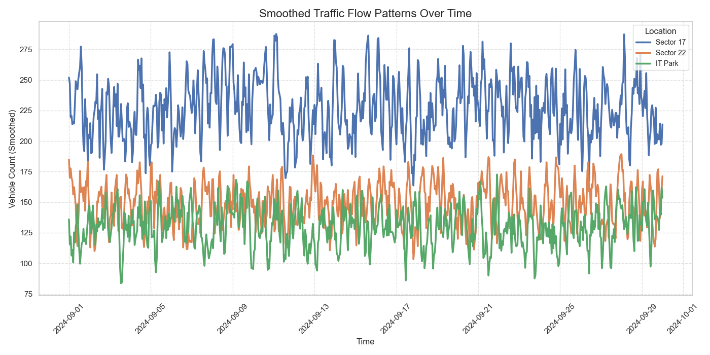
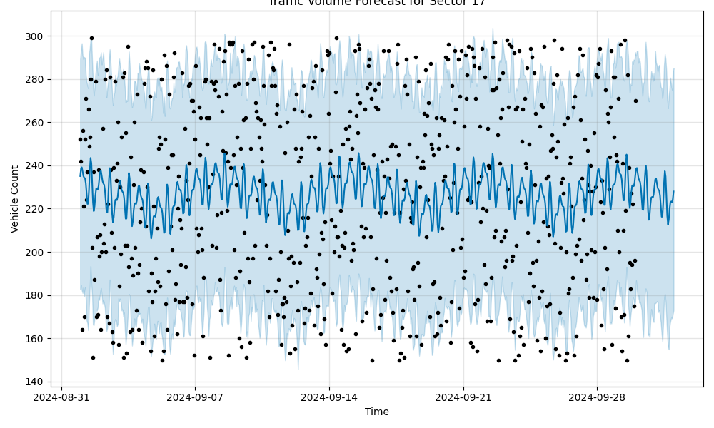

# Urban Traffic Flow Optimization

## Welcome!

This project is dedicated to analyzing and optimizing traffic patterns in Chandigarh, using simulated data. While this data doesn't reflect real-world traffic, it helped demonstrate how we can use data analysis and forecasting techniques to explore traffic patterns and make suggestions on improving flow.

## What I Did

- **Analyzed Traffic Data:** Visualized traffic flow across different city sectors, focusing on key areas like Sector 17, IT Park, and Sector 22.
- **Forecasted Future Trends:** Used the Prophet library to predict future traffic volumes to aid planning and decision-making.
- **Suggested Improvements:** Based on my findings, I proposed practical solutions to enhance traffic management and reduce congestion.

## The Data

I worked with simulated hourly vehicle counts from various locations in Chandigarh:
- **Sector 17:** Known for its commercial activity.
- **IT Park:** A hub of business operations.
- **Sector 22:** A quieter residential area.

## My Approach

1. **Data Preparation:**
   - I generated simulated hourly vehicle counts for various locations in Chandigarh

2. **Exploratory Analysis:**
   - Created visualizations to identify trends, peak times, and potential bottlenecks.

3. **Predictive Modeling:**
   - Applied Prophet for time series forecasting, generating forecasts with confidence intervals to account for uncertainty.

4. **Optimization Strategies:**
   - Suggested changes such as adjusting traffic signals during peak hours and enhancing public transport options.

## Visual Insights

### Traffic Flow Patterns Over Time

This plot compares traffic patterns across different locations, highlighting areas with potential congestion. It provides a clear view of how traffic varies by location and time.

### Traffic Volume Forecast for Sector 17

The forecast shows regular fluctuations, indicating predictable traffic patterns. The shaded area represents prediction uncertainty, which is crucial for planning robust solutions.

## Key Takeaways
1. **Pattern Recognition**: The data shows repeating cycles of high and low traffic, much like real rush hours and quieter periods.
2. **Simulated Traffic Surges**: There are significant spikes in traffic, which could represent accidents or roadblocks in a real setting.
3. **Congestion Potential**: The busiest times see up to 300 vehicles, hinting at possible congestion during peak hours.

## Possible Ways to Improve Traffic (If This Were Real)
1. **Smarter Traffic Lights**: Adjusting traffic light timing based on live data can reduce jams during rush hours.
2. **Real-Time Monitoring**: Sensors or cameras can help manage unexpected traffic surges quickly.
3. **Managing Peak Hours**: Staggering work hours or encouraging public transport use could lower traffic during the busiest times.
4. **Responding to Incidents**: Faster response to road accidents or breakdowns can prevent extended congestion.
5. **Planning for Events**: Special events can increase traffic volume, so extra management during these times would be helpful.

## Tools Used
- Python
- Prophet (for forecasting)
- Matplotlib (for plotting graphs)

## Next Steps
- Try working with real traffic data to see how our strategies hold up.
- Use these insights to create smarter traffic management systems.

---

**Note**: This project uses **simulated data**, meaning it’s artificially generated and not real. However, it still helps show how data analysis can inform decisions to improve traffic management in cities.
